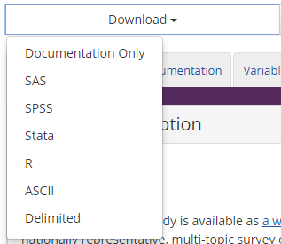

## tidyICPSR

This is a draft R package that can be used to download and format [ICPSR data]. It can be installed with

```R
#install.packages("devtools")
devtools::install_github("hathawayj/tidyICPSR")
```

## Background on ICPSR

The Inter-university Consortium for Political and Social Research (ICPSR) has a broad data collection.  See their history [here](https://www.icpsr.umich.edu/icpsrweb/content/about/history/timeline.html). Specifically, they have two studies on India.

The [India Human Development Survey - I](https://www.icpsr.umich.edu/icpsrweb/ICPSR/studies/22626) and [India Human Development Survey - II](https://www.icpsr.umich.edu/icpsrweb/ICPSR/studies/36151?q=india+human+development+survey&searchSource=icpsr-landing) have provided documentation on their studies.  

## Data Download

You can use their download functionality on the website or use the `icpsr_download()` function[^1].

### Manual

The ICPSR requires that users of their data register.  The registration process is not difficult. They have provided the data for download in multiple file formats under the 'Download' button. We recommend the 'Delimeted' format. 





### icpsr_download()


The `icpsr_download(file_id = 22626, download_dir = "data")` will download the available data for the 2005 study on India.  If you look at the URL for data pages on icpsr.umich.edu you will see links in the format - <https://www.icpsr.umich.edu/icpsrweb/ICPSR/studies/22626>.  The `file_id` is the set of numbers at the end of the URL.

The `download_dir` variables specifies where the data will be downloaded.  If you would like to avoid setting your email and password used when you registered you can use the method I stole from [Jenny Bryan's material](https://github.com/jennybc/happy-git-with-r/blob/master/81_github-api-tokens.Rmd). 

Just run the following in your R console and restart R.

```R
cat("icpsr_email=hathawayj@gmail.com\n",
    file = file.path(normalizePath("~/"), ".Renviron"), append = TRUE)
cat("icpsr_password=YOURPASSWORD\n",
    file = file.path(normalizePath("~/"), ".Renviron"), append = TRUE)

```

Running the following commands should return your email and password and not store that information in any public file.

```R
Sys.getenv("icpsr_email")
Sys.getenv("icpsr_password")

```

Now you can use the following command to set options so your password and email don't have to be specified each time you run `icpsr_download()`

```R
options("icpsr_email" = Sys.getenv("icpsr_email"), "icpsr_password" = Sys.getenv("icpsr_password"))
```


[^1]: Thanks to Frederick Solt and the [icpsrdata package](https://github.com/fsolt/icpsrdata) we can use the `icpsr_download()` function as well. I have made a few tweaks from his download function.
