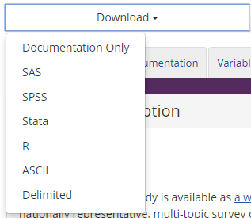

```{r setup, include = FALSE}
knitr::opts_chunk$set(
  collapse = TRUE,
  comment = "#>"
)
```

The  Inter-university Consortium for Political and Social Research (ICPSR) has a broad data collection.  See their history [here](https://www.icpsr.umich.edu/icpsrweb/content/about/history/timeline.html). Specifically, they have two studies on India.

The [India Human Development Survey - I](https://www.icpsr.umich.edu/icpsrweb/ICPSR/studies/22626) and [India Human Development Survey - II](https://www.icpsr.umich.edu/icpsrweb/ICPSR/studies/36151?q=india+human+development+survey&searchSource=icpsr-landing) have provided documentation on their studies.  They have also provided the data download in multiple file formats under the 'Download' button. We recommend the 'Delimeted' format.  



We used the following files for this example;

- The 2005 survey is named `ICPSR_22626-V11.zip`. 
- The 2011 survey is named `ICPSR_36151-V5.zip`. 

Thanks to Frederick Solt and the [icpsrdata package](https://github.com/fsolt/icpsrdata) we can use the `icpsr_download()` function as well.  This guide will use the data retrieved from `icpsr_download()` function.


```{r}


```


Vignettes are long form documentation commonly included in packages. Because they are part of the distribution of the package, they need to be as compact as possible. The `html_vignette` output type provides a custom style sheet (and tweaks some options) to ensure that the resulting html is as small as possible. The `html_vignette` format:

- Never uses retina figures
- Has a smaller default figure size
- Uses a custom CSS stylesheet instead of the default Twitter Bootstrap style

## Vignette Info

Note the various macros within the `vignette` section of the metadata block above. These are required in order to instruct R how to build the vignette. Note that you should change the `title` field and the `\VignetteIndexEntry` to match the title of your vignette.

## Styles

The `html_vignette` template includes a basic CSS theme. To override this theme you can specify your own CSS in the document metadata as follows:

    output: 
      rmarkdown::html_vignette:
        css: mystyles.css

## Figures

The figure sizes have been customised so that you can easily put two images side-by-side. 

```{r, fig.show='hold'}
plot(1:10)
plot(10:1)
```

You can enable figure captions by `fig_caption: yes` in YAML:

    output:
      rmarkdown::html_vignette:
        fig_caption: yes

Then you can use the chunk option `fig.cap = "Your figure caption."` in **knitr**.

## More Examples

You can write math expressions, e.g. $Y = X\beta + \epsilon$, footnotes^[A footnote here.], and tables, e.g. using `knitr::kable()`.

```{r, echo=FALSE, results='asis'}
knitr::kable(head(mtcars, 10))
```

Also a quote using `>`:

> "He who gives up [code] safety for [code] speed deserves neither."
([via](https://twitter.com/hadleywickham/status/504368538874703872))
